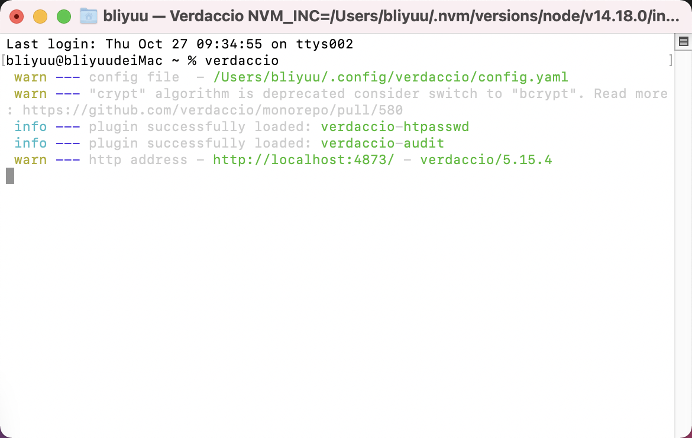
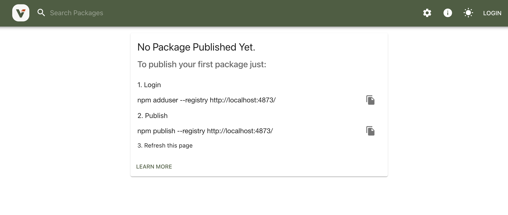

# 局域网内搭建 npm 私有仓库

## 在 node 环境下，安装 verdaccio

```bash
npm i -g verdaccio
```

## 启动 verdaccio 查看



-   第一行指明了 verdaccio 的配置文件
-   最后一行是指可视化地址和端口号。
    一般是 http://localhost:4873/



## 修改配置文件，使局域网下可以访问

```bash
vim /Users/.../.config/verdaccio/config.yaml
```

在末尾添加后保存

```bash
listen: 0.0.0.0:4873
```

## 使用 pm2 管理进程

```bash
#安装
npm i pm2 -g

#启动
pm2 start verdaccio
```

完成后使用 IP 地址 + 端口号，可以查看是否启动成功。

## 注册用户

```bash
npm adduser
```

## 切换仓库源

```bash
nrm add <registry> http://[IP]:4873
nrm use <registry>
```

## 发布仓库

```bash
# 登录
npm login

# 发布
npm publish
```
