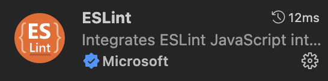

# 插件介绍

-   [eslint：代码质量校验](https://eslint.org/)
-   [stylelint：css 校验](https://stylelint.io/user-guide/get-started)
-   [prettier：代码风格统一](https://prettier.io/)
-   [husky: git hooks (代码提交前全部校验)](https://typicode.github.io/husky/#/)
-   [lint-staged: git hooks (校验 git add 暂存区文件)](https://github.com/okonet/lint-staged)
-   [commitlint: 规范提交信息](https://commitlint.js.org/#/)

-   vue2/vetur：代码高亮 + 智能提示 + ...
-   vue3/volar：代码高亮 + 智能提示 + ...

::: tip
为什么有了 vetur 和 volar，还要用 prettier？

1.  vetur 的代码风格也是基于 prettier 的。
2.  prettier 可以统一 vue2 和 vue3 的代码风格。
3.  前端规范化的主流。

:::

## eslint

1. 安装

```bash
npm install -D eslint
```

2. vscode 安装 ESlint 插件



3. 配置 Eslint 文件

```js
npm init @eslint/config
```

```js
How would you like to use ESLint? …    // 使用 Eslint 做什么
  To check syntax only                 // 只检查语法
√ To check syntax and find problems    // 检查语法，查找错误
  To check syntax, find problems, and enforce code style   // 检查语法，查找错误，强制代码风格

What type of modules does your project use? …   // 项目使用的模块化
√ JavaScript modules (import/export)            // es6 模块化
  CommonJS (require/exports)                    // CommonJS 模块化

Which framework does your project use? …    // 项目使用的框架
  React
√ Vue.js

Does your project use TypeScript     // 是否使用了 ts

// 代码运行在哪
// 注意此处应该多选，因为项目也运行在node上
Where does your code run? …  (Press space to select, a to toggle all, i to invert selection)
√ Browser
√ Node

What format do you want your config file to be in? ...  //配置文件的类型
√ JavaScript
  YAML
  JSON
```

4. 全部选择完，安装提示的插件，然后自动生成 .eslintrc.js 配置文件

5. 创建 .eslintignore 文件

```js
node_modules/
dist/

// # Ignore all HTML files:
// *.html
```

## stylelint

<!-- 1. 安装 stylelint 和标准配置

```bash
npm install -D stylelint stylelint-config-standard
```

2. 在项目的根目录中创建一个配置文件 .stylelintrc.js -->

## prettier

1. 安装

```bash
npm install -D prettier
```

2. vscode 安装 Prettier 插件


3. 因为 eslint 和 prettier 有样式统一的冲突，所以需要下载插件解决冲突

```js
npm i prettier eslint-config-prettier eslint-plugin-prettier -D
```

.eslintrc 配置文件，在 "extend" 下最后一行添加 prettier

```json
//.eslintrc.js
{
    "extends": ["plugin:prettier/recommended"]
}
```

4. 创建 .prettierignore 文件

```js
node_modules/
dist/

// # Ignore all HTML files:
// *.html
```

5. 创建 .prettierrc.js 文件

```js
module.exports = {
    // default 80： 一行最多 80 字符
    printWidth: 80,
    // default 2： 使用 4 个空格缩进
    tabWidth: 4,
    // default false： 不使用 tab 缩进，而使用空格
    useTabs: false,
    // default true： 行尾需要有分号
    semi: true,
    // default false： 使用单引号
    singleQuote: false,
    /**
     * object 中 key 值是否加引号
     *
     * as-needed: 需要的时候加
     * consistent: 有一个需要就加
     * preserve: 不做处理，保留用户输入
     */
    quoteProps: "as-needed",
    // default false： jsx 使用单引号
    jsxSingleQuote: false,
    /**
     * 如果有逗号分隔多行的情况下，尽可能每一行尾随逗号
     *
     * es5: es5的对象、数组
     * none: 没有尾随逗号
     * all: 尽可能使用尾随逗号
     */
    trailingComma: "es5",
    // default true： 大括号内的首尾需要空格 { foo: bar }
    bracketSpacing: true,
    // default false： 将多行 HTML标签 的  >  放在末尾还是另起一行
    bracketSameLine: true,
    /**
     * default always： 箭头函数参数是否有括号
     *
     * always
     * avoid
     */
    arrowParens: "always",
    // 每个文件格式化的范围是文件的全部内容
    rangeStart: 0,
    rangeEnd: Infinity,
    // 不需要写文件开头的 @prettier
    requirePragma: false,
    // 不需要自动在文件开头插入 @prettier
    insertPragma: false,
    // 使用默认的折行标准
    proseWrap: "preserve",
    // 空格敏感性
    htmlWhitespaceSensitivity: "css",
    // vue 文件中 script和style 标签内缩进
    vueIndentScriptAndStyle: true,
    // 换行符使用 lf
    endOfLine: "lf",
    /**
     * default always： 格式化嵌入代码
     *
     * auto
     * off
     */
    embeddedLanguageFormatting: "auto",
    // 属性换行
    singleAttributePerLine: true,
};
```

## lint-staged

1. 安装

```bash
npx mrm@2 lint-staged
```

2. 修改 `package.json` 文件，以遵循你自己的规范，例如

```json
"lint-staged": {
    "src/**/*.{js,jsx,ts,tsx,vue}": [
        "eslint --cache --fix --cache-location ./node_modules/.cache/.eslintcache"
    ],
    "*": "prettier --write --ignore-unknown"
}
```

3. 如果需要控制 lint 和 prettier 的并发数，需要在 `.husky` 的 `pre-commit` 中修改语句

```bash
npx lint-staged --concurrent false
```

::: tip
此情况在 eslint 和 prettier 可能同时作用在同一文件时有用
:::

自定义配置看文档。

## commitlint

1. 安装

```bash
npm install -D @commitlint/config-conventional @commitlint/cli
```

2. 为 husky 启用 `commit-msg` 钩子

```bash
npx husky add .husky/commit-msg  "npx --no -- commitlint --edit ${1}"
```

3. 提交规范

类似于以下格式

```js
type(scope?): subject

//例
chore: run tests on travis ci
fix(server): send cors headers
feat(blog): add comment section
```

常用的 commit 规范类型有

```js
"build", // 编译相关的修改，例如发布版本、对项目构建或者依赖的改动
"feat", // 新功能
"fix", // 修补bug
"docs", // 文档修改
"style", // 代码格式修改, 注意不是 css 修改
"refactor", // 重构
"perf", // 优化相关，比如提升性能、体验
"test", // 测试用例修改
"revert", // 代码回滚
"ci", // 持续集成修改
"config", // 配置修改
"chore", // 其他改动
```

4. 配置 `commitlint.config.js` 文件

```js
module.exports = {
    extends: ["@commitlint/config-conventional"],
    rules: {
        "type-enum": [
            // type枚举
            2,
            "always",
            [
                "build", // 编译相关的修改，例如发布版本、对项目构建或者依赖的改动
                "feat", // 新功能
                "fix", // 修补bug
                "docs", // 文档修改
                "style", // 代码格式修改, 注意不是 css 修改
                "refactor", // 重构
                "perf", // 优化相关，比如提升性能、体验
                "test", // 测试用例修改
                "revert", // 代码回滚
                "ci", // 持续集成修改
                "config", // 配置修改
                "chore", // 其他改动
            ],
        ],
        "type-empty": [2, "never"], // never: type不能为空; always: type必须为空
        "type-case": [0, "always", "lower-case"], // type必须小写，upper-case大写，camel-case小驼峰，kebab-case短横线，pascal-case大驼峰，等等
        "scope-empty": [0],
        "scope-case": [0],
        "subject-empty": [2, "never"], // subject不能为空
        "subject-case": [0],
        "subject-full-stop": [0, "never", "."], // subject以.为结束标记
        "header-max-length": [2, "always", 72], // header最长72
        "body-leading-blank": [0], // body换行
        "footer-leading-blank": [0, "always"], // footer以空行开头
    },
};
```
